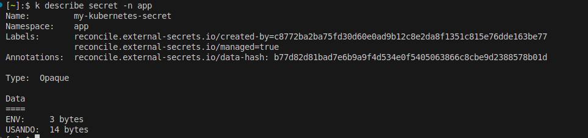

# External-secrets


## Install controller

Recomendo utilizar a conexão OIDC do EKS, para isso basta criar uma role e utilizar no service-account da values conforme exemplo abaixo:

```yaml
serviceAccount:
  # -- Specifies whether a service account should be created.
  create: true
  # -- Automounts the service account token in all containers of the pod
  automount: true
  # -- Annotations to add to the service account.
  annotations:
    eks.amazonaws.com/role-arn: arn:aws:iam::<ACCOUNT-ID>:role/external-secrets-role
  # -- Extra Labels to add to the service account.
  extraLabels: {}
  # -- The name of the service account to use.
  # If not set and create is true, a name is generated using the fullname template.
  name: "external-secrets"
```

Exemplo da policy `policy.json` e `trust-policy.json` segue neste repositório

Instalando o controller

```bash
kubectl create ns external-secrets
```
```bash
helm repo add external-secrets https://charts.external-secrets.io
```
```bash
helm install external-secrets external-secrets/external-secrets -f values.yaml -n external-secrets
```

## Uso básico

Basicamente precisamos de dois componentes para usar o external secrets 

- `SecretStore` ou `ClusterSecretStore`
- `ExternalSecret` ou `ClusterExternalSecret`

Neste exemplo vou utilizar o ClusterSecretStore que é um SecretStore com escopo de cluster que pode ser referenciado por todos os ExternalSecrets de todos os namespaces. 

No SecretStore é onde você referencia o provider que irá extrair a secret aqui uso o secret-manager da AWS

- clusterStoreSecret.yaml

```yaml
apiVersion: external-secrets.io/v1beta1
kind: ClusterSecretStore
metadata:
  name: aws-secrets-manager
spec:
  provider:
    aws:
      service: SecretsManager
      region: us-east-1
      auth:
        jwt:
          ## Referencia da service account criada no values 
          serviceAccountRef:
            name: external-secrets
            namespace: external-secrets
```


Para que o external secret crie a secret no k8s você deve utilizar o `external-secrets` ou `cluster-external-secrets`, a diferença entre os dois é que um o escopo é a nível de namespace e outro a nível global no cluster

- ExternalSecret.yaml

```yaml
apiVersion: external-secrets.io/v1
kind: ExternalSecret
metadata:
  name: my-external-secret
  namespace: app
spec:
  refreshInterval: 1h
  secretStoreRef:
    name: aws-secrets-manager
    kind: ClusterSecretStore
  target:
    name: my-kubernetes-secret <<NOME-DA-SECRET-K8S>>
    creationPolicy: Owner
  dataFrom:
  - extract:
     key: external-secrets <<NOME-SECRET-MANAGER>>
```


- Secret criada




- No secret manager


No Kubernetes, podemos utilizar o envFrom, no qual passamos uma Secret ou um ConfigMap, e as variáveis de ambiente são criadas automaticamente.

```yaml
containers:
    - name: test-container
      image: k8s.gcr.io/busybox
      command: [ "/bin/sh", "-c", "while sleep 2; do echo thinking; done" ]
      envFrom:
      - secretRef:
          name: my-kubernetes-secret
```


O ExternalSecret realiza o refresh no Secret Manager, de forma que, sempre que houver alguma atualização, isso será refletido automaticamente no Secret dentro do Kubernetes.

Caso queira utilizá-lo em nível global, é possível usar o ClusterExternalSecret.
A principal diferença entre os dois é que, no ClusterExternalSecret, utilizamos o campo namespaceSelectors. Essa label deve estar presente nos namespaces em que desejamos disponibilizar as Secrets.

- ClusterExternalSecret.yaml

```yaml
apiVersion: external-secrets.io/v1
kind: ClusterExternalSecret
metadata:
  name: my-ext-cluster-secret
spec:
  # The name to be used on the ExternalSecrets
  externalSecretName: "my-cluster-secret"

  namespaceSelectors:
  - matchLabels:
      secret: external

  # How often the ClusterExternalSecret should reconcile itself
  # This will decide how often to check and make sure that the ExternalSecrets exist in the matching namespaces
  refreshTime: "1m"

  # This is the spec of the ExternalSecrets to be created
  # The content of this was taken from our ExternalSecret example
  externalSecretSpec:
    secretStoreRef:
      name: aws-secrets-manager
      kind: ClusterSecretStore

    # RefreshPolicy determines how the ExternalSecret should be refreshed:
    # - CreatedOnce: Creates the Secret only if it does not exist and does not update it afterward
    # - Periodic: (default) Synchronizes the Secret at intervals specified by refreshInterval
    # - OnChange: Only synchronizes when the ExternalSecret's metadata or specification changes
    refreshPolicy: Periodic

    refreshInterval: "1h"
    target:
      name: my-secret-cluster
      creationPolicy: 'Owner'
    dataFrom:
    - extract:
      key: external-secrets <<NAME-SECRET-MANAGER>>
```

Exemplo

```yaml
apiVersion: v1
kind: Namespace
metadata:
  labels:
    kubernetes.io/metadata.name: app
    secret: external
  name: app
```

#
https://external-secrets.io/latest/api/components/

https://github.com/external-secrets/external-secrets/tree/main/deploy/charts/external-secrets